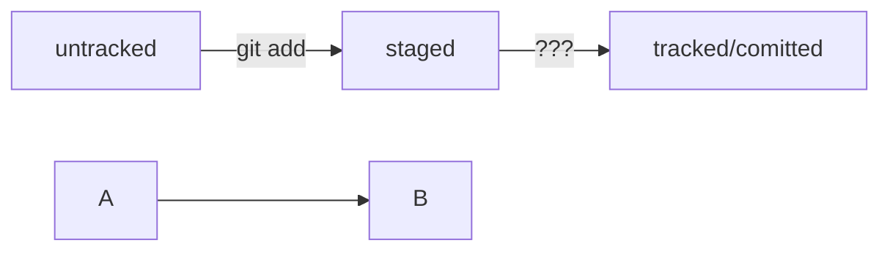

### Test README file
---
Hello friends, it is test repos for teach Git and GitHub. In this leson i
1. first point
2. second point
3. tree point

---

And more 

- Point
- Another point
- End point

Команды для работы с коммитами и изминениями

- git restore --staged <file> - переведёт файлы из `staged` в `modified` или `untracked`
- git reset --hard <commit hash> - откатит история до выбраного коммита более поздние комиты удалятся
- git restore <file> - откат изминений в файлу до последней сохраннёной версии
