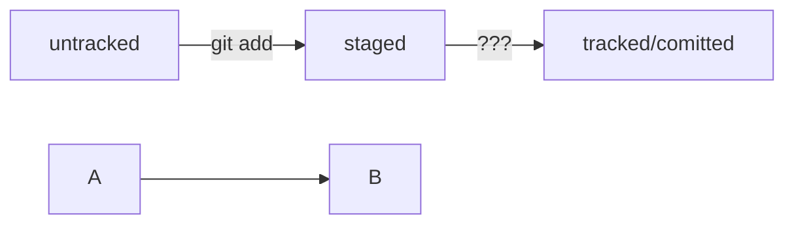

### Test README file
---
Hello friends, it is test repos for teach Git and GitHub. In this leson i
1. first point
2. second point
3. tree point

---

And more 

- Point
- Another point
- End point

