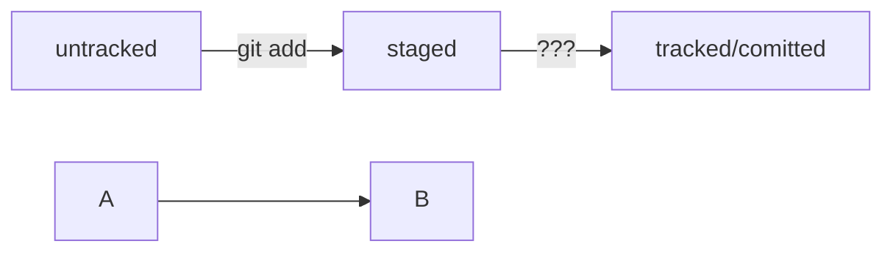

### Test README file
---
Hello friends, it is test repos for teach Git and GitHub. In this leson i
1. first point
2. second point
3. tree point

---

And more 

- Point
- Another point
- End point

Команды для работы с коммитами и изминениями

- `git restore --staged <file>` - переведёт файлы из `staged` в `modified` или `untracked`
- `git reset --hard <commit hash>` - откатит история до выбраного коммита более поздние комиты удалятся
- `git restore <file>` - откат изминений в файлу до последней сохраннёной версии

Для просмотра изменений в файлах
- `git diff` - для файлов не дабавленых в add
- `git diff <commit hash> <commit hash>` - для просмотра изминений между коммитами

Работа с .gitignore
- * - все файлы и папки (*.txt - все файлы с .txt)
- ** - все файлы и папки с вложеностью от 0-n (**.txt - main/submain/texts/book.txt)
- [] - перечисляемый символ (file[0-9].txt - все файлы с цыфрой после file, так же можно [a-z], [abgf])
- ! - отрицание чего либо (*.txt и !readme.txt - все файлы .txt кроме readme.txt)

# Работа с ветками в GIT

- Для просмотра существующих веток используем - git branch

- Для создания - git branch <имя ветки> (git branch newBranch)

- Для перехода по веткам - git checkout <имя ветки> (git checkout newBranch)

