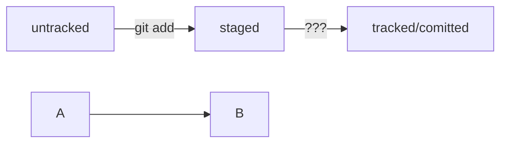

### Test README file
---
# Работа со списками для визуализации 
Для нумерации ( 1. )
1. first point 
2. second point
3. tree point
---
Для не нумерованого ( - )
- Point
- Another point
- End point

# Mermaid график


# Команды для работы с коммитами и изменениями

```bash
git restore --staged <file> # переведёт файлы из `staged` в `modified` или `untracked`

git reset --hard <commit hash> # откатит история до выбраного коммита более поздние комиты удалятся

git restore <file> # откат изминений в файлу до последней сохраннёной версии
```

---
Для просмотра изменений в файлах

```bash
git diff # для файлов не дабавленых в add

git diff <commit hash> <commit hash> # для просмотра изминений между коммитами
```

# Работа с .gitignore
- *  все файлы и папки (*.txt - все файлы с .txt)
- **  все файлы и папки с вложеностью от 0-n (**.txt - main/submain/texts/book.txt)
- []  перечисляемый символ (file[0-9].txt - все файлы с цыфрой после file, так же можно [a-z], [abgf])
- !  отрицание чего либо (*.txt и !readme.txt - все файлы .txt кроме readme.txt)


# Шпаргалка. Работа с ветками
## Клонирование чужого репозитория
```bash
git clone git@github.com:YandexPraktikum/first-project.git (от англ. clone, «клон», «копия») — склонируй репозиторий с URL first-project.git из аккаунта YandexPraktikum на мой локальный компьютер.
```
## Создание веток
```bash
git branch feature/the-finest-branch (от англ. branch, «ветка») — создай ветку от текущей с названием feature/the-finest-branch;
git checkout -b feature/the-finest-branch — создай ветку feature/the-finest-branch и сразу переключись на неё.
```
## Навигация по веткам
```bash
git branch (от англ. branch, «ветка») — покажи, какие есть ветки в репозитории и в какой из них я нахожусь (текущая ветка будет отмечена символом *);
git branch -a — покажи все известные ветки, как локальные (в локальном репозитории), так и удалённые (в origin, или на GitHub).
git checkout feature/br — переключись на ветку feature/br.
```
## Сравнение веток
```bash
git diff main HEAD (от англ. difference, «отличие», «разница») — покажи разницу между веткой main и указателем на HEAD;
git diff HEAD~2 HEAD — покажи разницу между тем коммитом, который был два коммита назад, и текущим.
```
## Удаление веток
```bash
git branch -d br-name — удали ветку br-name, но только если она является частью main;
git branch -D br-name — удали ветку br-name, даже если она не объединена с main.
```
## Слияние веток
```bash
git merge main (от англ. merge, «сливать», «поглощать») — объедини ветку main с текущей активной веткой. 
```
## Работа с удалённым репозиторием
```bash
git push -u origin my-branch (от англ. push, «толкнуть», «протолкнуть») — отправь новую ветку my-branch в удалённый репозиторий и свяжи локальную ветку с удалённой, чтобы при дополнительных коммитах можно было писать просто git push без -u;
git push my-branch — отправь дополнительные изменения в ветку my-branch, которая уже существует в удалённом репозитории;
git pull (от англ. pull, «вытянуть») — подтяни изменения текущей ветки из удалённого репозитория.
```
